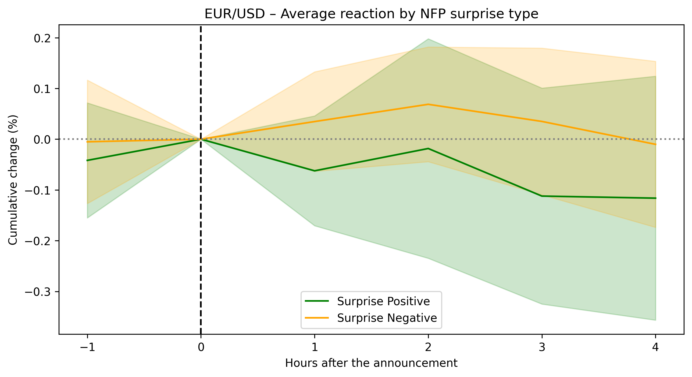

# Event Study on NFP – EUR/USD & US 10Y Analysis

**Author :** Raphaël Essengue  
**Field :** Finance & Data Science  
**Focus :** Market Reaction Analysis to US Nonfarm Payrolls (NFP)  
**Tools :** Python, Pandas, Matplotlib, Statsmodels


## Overview

This project studies the short-term reaction of **EUR/USD** and **US 10-Year Treasury yields (US10Y)** around the release of the **US Nonfarm Payrolls (NFP)** data.

Using hourly financial data, the study quantifies and visualizes how markets respond to NFP surprises — one of the most anticipated macroeconomic announcements in global markets.


## Methodology

1. **Event Window Construction :**  
   - Builds windows around each NFP release: from **1 hour before** to **4 hours after** (`[-1h, +4h]`).

2. **Returns Calculation :**  
   - Computes hourly percentage changes for EUR/USD and US10Y.

3. **Aggregation by Surprise Type :**  
   - Groups announcements into *positive* vs *negative* surprises based on the difference between **Actual** and **Forecast** values.

4. **Regression Analysis :**  
   - Runs **OLS regressions** to test whether NFP surprises significantly affect market movements.


## Tools and Libraries

- **Python**
- `pandas` — data manipulation  
- `numpy` — numerical computation  
- `matplotlib` — visualization  
- `statsmodels` — econometric modeling  

All dependencies are listed in [`requirements.txt`](requirements.txt).


## Project Structure

```text
event-study-nfp/
├─ notebooks/
│  └─ event_study_nfp.ipynb
├─ data/
│  └─ Nonfarm_Payrolls.csv
├─ figures/
│  ├─ average_reaction_NFP.png
│  ├─ individual_EURUSD_reactions.png
│  ├─ individual_%20US10Y_reactions.png
│  ├─ EURUSD_average_reaction_NFP_surprise_type.png
│  └─ US10Y_average_reaction_NFP_surprise_type.png
├─ requirements.txt
├─ README.md
└─ LICENSE
```


## Key Results

### Average Market Reactions
Shows the **average cumulative variation** of EUR/USD and US10Y around NFP announcements.


### Individual Event Reactions
Displays the **heterogeneity of individual market reactions** across different NFP releases.


### Reaction by Surprise Type
Differentiates market behavior following *positive* vs *negative* NFP surprises.




## Run the Analysis on Google Colab

You can open and execute the full notebook directly in Colab:

[](https://colab.research.google.com/github/raphessengue-create/event-study-nfp/blob/main/notebooks/event_study_nfp.ipynb)


## Interpretation Highlights

- **EUR/USD :** tends to slightly depreciate following *stronger-than-expected* NFP (positive surprises).  
- **US10Y yields :** show upward pressure when the labor report is stronger, consistent with tighter rate expectations.  
- Reactions are visible within the **first few hours** after the release, then stabilize.


## License

This project is released under the [MIT License](LICENSE).


## About the Author

**Raphaël Essengue**  
Université Panthéon-Assas – Master’s Student in Finance (Financial Markets)
Interested in **Sales & Trading, Quantitative Research and Macroeconomic Modeling**.  
[LinkedIn Profile](https://www.linkedin.com/in/raphael-essengue/)
